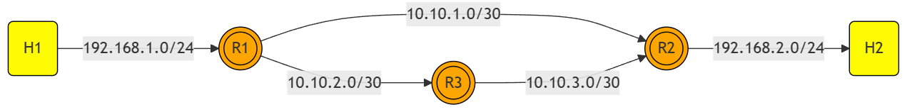

<h1 align="center">
  <br>
    
</h1>

# Dynamic Routing
Welcome to the Dynamic Routing Repository. This documentation will guide you through understanding and setting up Dynamic Routing on your system. You will find all the necessary information and tools in this comprehensive guide.

## Table of Contents
1. [Configuration](#configuration)
2. [Prerequisites](#prerequisites)
3. [Steps](#steps)

# Configuration
<h1 align="center">
  <br>
    
</h1>

# Prerequisites
Before proceeding with the setup, ensure that you have the following prerequisites:

1. **Ubuntu**: If you are using Windows, you can download Ubuntu from:
    [Ubuntu](https://ubuntu.com/desktop/wsl)

2. **Mininet**: Download Mininet from:
    [Mininet](https://mininet.org/)

3. Navigate to the Mininet directory:

    ```bash
    cd mininet
    ```

4. Install all Mininet dependencies by running the following command:

    ```bash
    ./util/install.sh -a
    ```

5. Once the installation is complete, you can proceed with the next steps.

# Steps
Follow the instructions below to get the system up and running:

1. Clone the repository:

    ```bash
    git clone https://github.com/TeamXNetRouter/JKL-DynamicRouting.git
    ```

2. Navigate to the project directory:

    ```bash
    cd JKL-DynamicRouting
    ```
3. Change the config storage place in the dynamic_routing.py file according to your ubuntu environment (line 39)
    ```bash
   ('/etc/frr', '/home/yourusername/net101/projects/frr-config/%(name)s')
    ```

3. Run the project using the following command:

    ```bash
    sudo python3 dynamic_routing.py
    ```

4. To test the setup, you can use the following command in the terminal:

    ```bash
    h1 traceroute -I h2
    ```

5. Even if the link between r1 and r2 is down, you can still perform a traceroute:

    ```bash
    link r1 r2 down
    h1 traceroute -I h2
    ```
---
